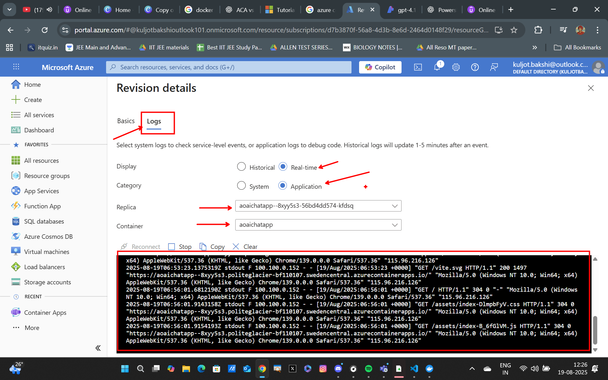

## ACR (Azure Container Registry) to ACA (Azure Container Apps)

### Create a Container Apps Environment
We will now create a container apps environment that will host our Container App.

Follow the steps laid down in the visuals below:

--

--

### Create a Container App
Now we will create a container app inside the newly create container app environment that will host our image that is contained in our Azure Container Registry. 

--

--

--

### Accessing our Chat Application
Once your container app gets provisioned, you can go to the `Revisions and replicas` tab to view the Application's FQDN, navigating to which will lead you to land on your chat application's homepage.

--

--

You can also view the logs of the running revision of your container app:

## Summary
In this lab, we successfully deployed a containerized chat application from Azure Container Registry (ACR) to Azure Container Apps (ACA). We created a container apps environment, set up a container app, and configured the necessary settings to ensure our application runs smoothly. Finally, we accessed our application and verified its functionality.
