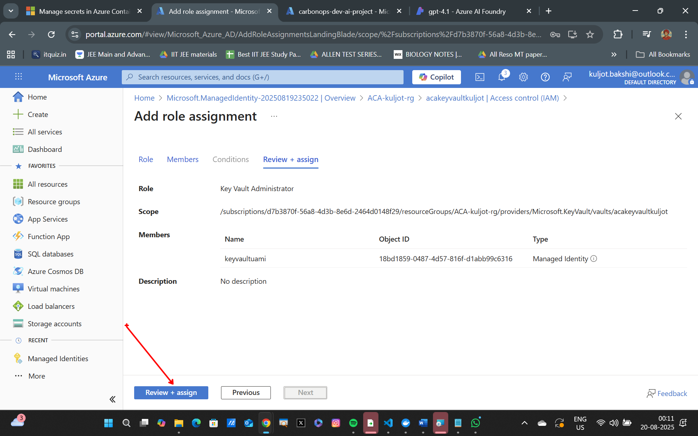

## Azure Container Apps (ACA) with Azure Key Vault (AKV) for Secret Storage


### Lab Overview
In this lab, we will explore how to integrate Azure Key Vault (AKV) with Azure Container Apps (ACA) to securely manage and access secrets. We will cover the following topics:
- Setting up Azure Key Vault
- Storing secrets in Azure Key Vault
- Configuring Azure Container Apps to access secrets from Azure Key Vault

### Prerequisites
Before you begin with this lab, make sure you are done with the following lab: [Environment Variables and Secrets in Azure Container Apps](./EnvVariables_and_Secrets.md)

### Setting Export Variables
Let's quickly go ahead and set some export variables for script usage as part of this lab exercise.
```bash
export ACR_NAME="YOUR_ACR_NAME"
export RG_NAME="YOUR_RESOURCE_GROUP_NAME"
export ACA_ENV_NAME="YOUR_ACA_ENV_NAME"
export AZURE_API_URL="YOUR_AZURE_API_URL"
export AZURE_API_KEY="YOUR_AZURE_API_KEY"
export AZURE_MODEL_NAME="YOUR_AZURE_MODEL_NAME"
```

### Building the ChatBackend Application

>**Note**: Skip this section if you are completed with this lab: [Building the ChatBackend Application](./Building_the_ChatBackend_Application.md) and have the `ChatBackend` application image in the Azure Container Registry.

We will now be building the ChatBackend application, which will utilize these environment variables and secrets for configuration.

Make sure docker desktop is running in the background.

Build the Image:
```bash
docker build -t chatbackend .
```

Run the image as a docker container locally:
```bash
docker run -e azure-api-url=$AZURE_API_URL -e azure-api-key=$AZURE_API_KEY -e azure-model-name=$AZURE_MODEL_NAME -p 5000:5000 chatbackend
```

Throw to following request to `localhost:5000` via the bash terminal to see the application in action:
```bash
curl -X POST http://localhost:5000/chat -H "Content-Type: application/json" -d "{\"message\":\"hi\"}"
```

Login to Azure Container Registry (ACR):
```bash
az acr login --name $ACR_NAME
```

Tag the image:
```bash
docker tag chatbackend $ACR_NAME.azurecr.io/chatbackend:latest
```

Push the Image to ACR:
```bash
docker push $ACR_NAME.azurecr.io/chatbackend:latest
```

### Creating Azure Key Vault
For this lab purposes, we will be using the `ChatBackend` application from one of the previous labs: [Environment Variables and Secrets in Azure Container Apps](./EnvVariables_and_Secrets.md)


--


--


--

Name the secret `azure-api-key` and set its value to the API key you obtained earlier from your Azure Foundry Project.


--

### Creating User Assigned Managed Identity (UAMI) with Permissions to Access AKV
Now we will apply RBAC (Role-Based Access Control) to allow the Azure Container Apps (ACA) to access the secrets stored in Azure Key Vault (AKV). This will happen in two steps:
1) Creating a User Assigned Managed Identity (UAMI)
2) Assigning the necessary permissions to the UAMI for accessing the secret in AKV

Now let's first create a User Assigned Managed Identity (UAMI) using the Azure Portal:


--


--

Now let's give the UAMI the necessary permissions to access the secret stored in AKV.


--

Select the `key Vault Administrator` role and assign it to the UAMI


--


--


--

### Deploying the ChatBackend Application to Azure Container Apps
Run the following command to deploy the application:
```bash
## login to azure CLI
az login

# Set Variables
export KEY_VAULT_SECRET_URI="<YOUR_KEY_VAULT_SECRET_URI>"
export UAMI_NAME="YOUR_UAMI_NAME"
export UAMI_IDENTITY_ID="YOUR_UAMI_IDENTITY_ID"

## Deploy Application to Container App
az containerapp create \
  -g $RG_NAME -n chatbackendapp-akv \
  --image $ACR_NAME.azurecr.io/chatbackend:latest \
  --environment $ACA_ENV_NAME \
  --target-port 5000 \
  --ingress external \
  --registry-server $ACR_NAME.azurecr.io \
  --user-assigned $UAMI_NAME \
  --registry-identity system \
  --secrets azure-api-key=keyvaultref:$KEY_VAULT_SECRET_URI,identityref:$UAMI_IDENTITY_ID \
  --env-vars azure-api-url=$AZURE_API_URL azure-model-name=$AZURE_MODEL_NAME azure-api-key=secretref:azure-api-key
```

Run the following command to test your deployment:
```bash
curl -X POST <YOUR_CONTAINER_APP_FQDN>/chat -H "Content-Type: application/json" -d "{\"message\":\"hi\"}"
```

### Summary
In this lab, we explored how to securely store and access secrets in Azure using Azure Key Vault (AKV) and User Assigned Managed Identity (UAMI). We built the ChatBackend application and configured it to use these secrets for its Azure API integration. By leveraging AKV and UAMI, we ensured that sensitive information, such as API keys, is not hard-coded into our application, but instead securely retrieved at runtime.