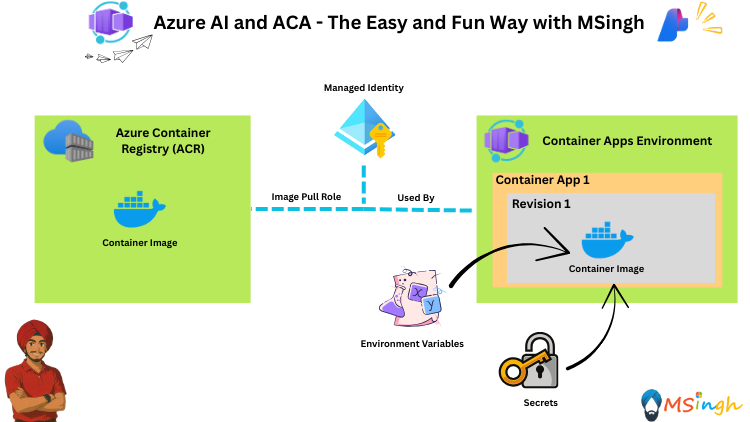
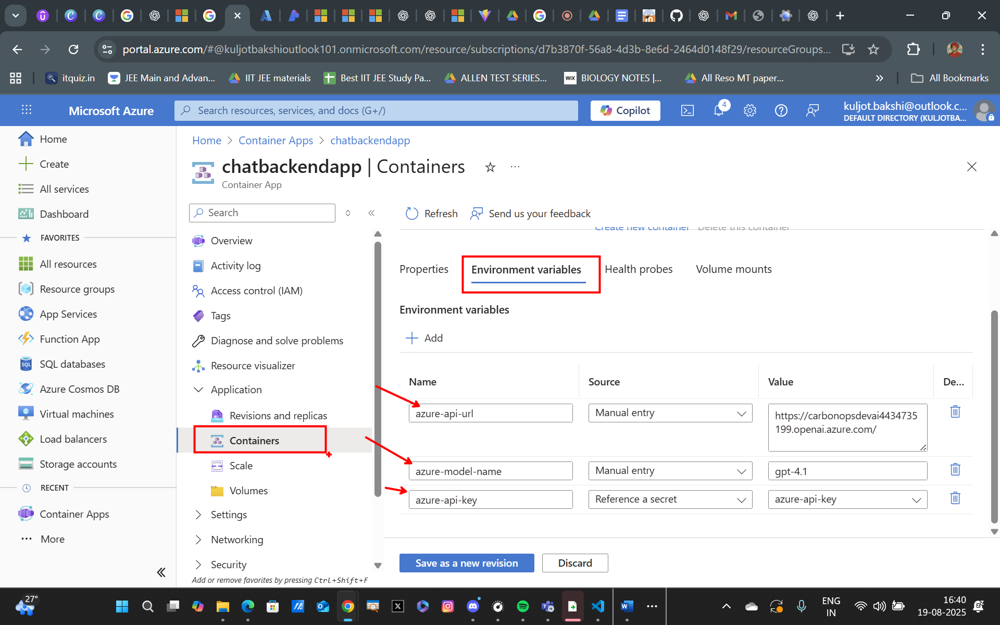

## Environment Variables and Secrets - Runtime Injection in ACA



### Lab Overview
In this lab, we will explore how to set environment variables and secrets in Azure Container Apps (ACA) to configure our ChatBackend application. This allows us to manage sensitive information securely and inject runtime configurations into our containerized applications.

### Setting some Export Variables
Set some export variables for usage in scripts for this lab:
```bash
export ACR_NAME="YOUR_ACR_NAME"
export AZURE_API_URL="YOUR_AZURE_OPENAI_ENDPOINT"
export AZURE_API_KEY="YOUR_AZURE_API_KEY"
export AZURE_MODEL_NAME="YOUR_AZURE_MODEL_NAME"
export RG_NAME="YOUR_RESOURCE_GROUP_NAME"
export ACA_ENV_NAME="YOUR_ACA_ENV_NAME"
```

### Building the ChatBackend Application
We will now be building the ChatBackend application, which will utilize these environment variables and secrets for configuration.

Make sure docker desktop is running in the background.

Build the Image:
```bash
docker build -t chatbackend .
```

Run the image as a docker container locally:
```bash
docker run -e azure-api-url=$AZURE_API_URL -e azure-api-key=$AZURE_API_KEY -e azure-model-name=$AZURE_MODEL_NAME -p 5000:5000 chatbackend
```

Throw to following request to `localhost:5000` via the bash terminal to see the application in action:
```bash
curl -X POST http://localhost:5000/chat -H "Content-Type: application/json" -d "{\"message\":\"hi\"}"
```

Login to Azure Container Registry (ACR):
```bash
az acr login --name $ACR_NAME
```

Tag the image:
```bash
docker tag chatbackend $ACR_NAME.azurecr.io/chatbackend:v1
```

Push the Image to ACR:
```bash
docker push $ACR_NAME.azurecr.io/chatbackend:v1
```

### Deploying the ChatBackend Application to Azure Container Apps
Now we will publish the `ChatBackend` application to Azure Container Apps from Azure Container Registry. The Environment Variables would be:
1) `AZURE_API_URL`
2) `AZURE_MODEL_NAME`

The Secrets would be:
1) `AZURE_API_KEY`

We will intend to inject both the Environment Variables and Secrets into the Azure Container App during runtime.

Login to `Azure CLI`:
```bash
az login
```

Run the following command to deploy the application:
```bash
az containerapp create \
  -g $RG_NAME -n chatbackendapp \
  --image $ACR_NAME.azurecr.io/chatbackend:v1 \
  --environment $ACA_ENV_NAME \
  --target-port 5000 \
  --ingress external \
  --registry-server $ACR_NAME.azurecr.io \
  --registry-identity system \
  --system-assigned \
  --secrets azure-api-key=$AZURE_API_KEY \
  --env-vars azure-api-url=$AZURE_API_URL azure-model-name=$AZURE_MODEL_NAME azure-api-key=secretref:azure-api-key
```

After successful provisioning, you can try out the request to the `/chat` endpoint again:
```bash
curl -X POST http://<ACA-FQDN>/chat -H "Content-Type: application/json" -d "{\"message\":\"hi\"}"
```

You can also check out your environment variables and secret key references made by the container app by going to the `Containers` tab under the `Application` tab in the Azure Portal.



You will also notice that the `azure-api-key` variable value is not visible as its not hardcoded but rather referenced as a secret. This ensures that sensitive information is not exposed in the application code or configuration.

### Summary
In this lab, we successfully configured environment variables and secrets for our ChatBackend application running in Azure Container Apps. We learned how to set these variables securely and inject them into our application at runtime, ensuring that sensitive information is not hard-coded into our application code. This approach enhances the security and flexibility of our application deployment in the cloud.
