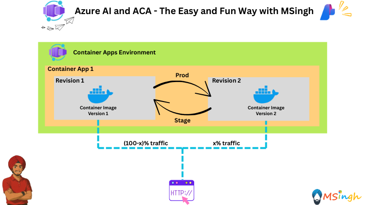

## Canary/A-B/Blue-Green Deployment Strategy with Azure Container App Revisions 



### Lab Overview
This lab explores the implementation of various deployment strategies using Azure Container Apps (ACA) revisions. We will focus on Canary, A-B, and Blue-Green deployment techniques to manage application updates and traffic routing effectively.

### Prerequisites
Before beginning this lab, ensure you have completed the following lab: [Environment Variables and Secrets in Azure Container Apps](./EnvVariables_and_Secrets.md)

### Setting Export Variables
Lets quickly set some export variables which will be of use to us to run some scripts as part of this lab.

```bash
export ACR_NAME="YOUR_ACR_NAME"
export AZURE_API_URL="YOUR_AZURE_OPENAI_ENDPOINT"
export AZURE_API_KEY="YOUR_AZURE_API_KEY"
export AZURE_MODEL_NAME_v1="YOUR_AZURE_MODEL_NAME_FOR_REVISION_1"
export AZURE_MODEL_NAME_v2="YOUR_AZURE_MODEL_NAME_FOR_REVISION_2"
export RG_NAME="YOUR_RESOURCE_GROUP_NAME"
export ACA_ENV_NAME="YOUR_ACA_ENV_NAME"
```

### Building the ChatBackend Application

> **Note**  
> Only follow these steps if you haven't completed the previous labs. Please skip this portion if done with the following lab: [Environment Variables and Secrets in Azure Container Apps](./EnvVariables_and_Secrets.md)

We will now be building the ChatBackend application, which will utilize these environment variables and secrets for configuration.

Make sure docker desktop is running in the background.

Build the Image:
```bash
docker build -t chatbackend .
```

Run the image as a docker container locally:
```bash
docker run -e azure-api-url=$AZURE_API_URL -e azure-api-key=$AZURE_API_KEY -e azure-model-name=$AZURE_MODEL_NAME -p 5000:5000 chatbackend
```

Throw to following request to `localhost:5000` via the bash terminal to see the application in action:
```bash
curl -X POST http://localhost:5000/chat -H "Content-Type: application/json" -d "{\"message\":\"hi\"}"
```

Login to Azure Container Registry (ACR):
```bash
az acr login --name $ACR_NAME
```

Tag the image:
```bash
docker tag chatbackend $ACR_NAME.azurecr.io/chatbackend:v1
```

Push the Image to ACR:
```bash
docker push $ACR_NAME.azurecr.io/chatbackend:v1
```

### Deploying Revision 1 to Azure Container Apps
We will now go ahead and deploy the `Revision 1` of the `ChatBackend` application to Azure Container Apps. A couple of quick key points:
1) This will use the `AZURE_MODEL_NAME_v1` environment variable for the model name.
2) This could be thought of as the **initial version** of the application, that is, the one which sits in the production slot and serves all traffic until we decide to route some percentage of it to a new revision.

Run the following command to deploy Revision 1:
```bash
az containerapp create \
  -g $RG_NAME -n chatbackendapp \
  --image $ACR_NAME.azurecr.io/chatbackend:latest \
  --revision-suffix v1 \
  --environment $ACA_ENV_NAME \
  --target-port 5000 \
  --ingress external \
  --registry-server $ACR_NAME.azurecr.io \
  --registry-identity system \
  --system-assigned \
  --secrets azure-api-key=$AZURE_API_KEY \
  --env-vars azure-api-url=$AZURE_API_URL azure-model-name=$AZURE_MODEL_NAME_v1 azure-api-key=secretref:azure-api-key \
  --revisions-mode multiple
```

Now run the following command to forward 100% of the traffic to the initial revision just created:
```bash
az containerapp ingress traffic set \
  --name chatbackendapp \
  --resource-group $RG_NAME \
  --revision-weight chatbackendapp--v1=100
```

Now we will apply a label `blue` to the initial revision (since this version would be running in the production environment initially in an enterprise set-up):
```bash
az containerapp revision label add \
  --name chatbackendapp \
  --resource-group $RG_NAME \
  --label blue \
  --revision chatbackendapp--v1
```

### Deploying Revision 2 to Azure Container Apps
We will now go ahead and deploy the `Revision 2` of the `ChatBackend` application to Azure Container Apps. A couple of quick key points:
1) This will use the `AZURE_MODEL_NAME_v2` environment variable for the model name.
2) This could be thought of as the **staging version** of the application, that is, the one which sits in the staging slot and serves zero external traffic until we decide to route some percentage of it to this new revision.

Run the following command to create an new revision for the `ChatBackend` application:
```bash
az containerapp update --name chatbackendapp \
  --resource-group $RG_NAME \
  --image --image $ACR_NAME.azurecr.io/chatbackend:latest \
  --revision-suffix v2  \
  --secrets azure-api-key=$AZURE_API_KEY \
  --env-vars azure-api-url=$AZURE_API_URL azure-model-name=$AZURE_MODEL_NAME_v2 azure-api-key=secretref:azure-api-key \
```

Now we will apply a label `staging` to the `v2` revision that we created:
```bash
az containerapp revision label add \
  --name chatbackendapp \
  --resource-group $RG_NAME \
  --label green \
  --revision chatbackendapp--v2
```

The following example shows how the traffic section is configured. The `v1` or `prod` revision is taking 100% of production traffic while the newly deployed `v2` or `staging` revision doesn't take any production traffic.

```json
{ 
  "traffic": [
    {
      "revisionName": "chatbackendapp--v1",
      "weight": 100,
      "label": "blue"
    },
    {
      "revisionName": "chatbackendapp--v2",
      "weight": 0,
      "label": "green"
    }
  ]
}
```

The newly deployed revision can be tested by using the label-specific FQDN:
```bash
#get the containerapp environment default domain
export APP_DOMAIN=$(az containerapp env show -g $RG_NAME -n $ACA_ENV_NAME --query properties.defaultDomain -o tsv | tr -d '\r\n')

#Test the production FQDN
curl -X POST https://chatbackend.$APP_DOMAIN/chat -H "Content-Type: application/json" -d "{\"message\":\"hi\"}"

#Test the blue label FQDN
curl -X POST https://chatbackend---v1.$APP_DOMAIN/chat -H "Content-Type: application/json" -d "{\"message\":\"hi\"}"

#Test the green label FQDN
curl -X POST https://chatbackend---v2.$APP_DOMAIN/chat -H "Content-Type: application/json" -d "{\"message\":\"hi\"}"
```

>**Note**: A thing to notice here is that even though the `v2` revision is not receiving any production traffic, it is still accessible via its label-specific FQDN. This allows for testing and validation of the new revision before it is promoted to production. Fascinating, isn't it!

### Sending Production Traffic to the Staging Revision
We will begin by sending Traffic in a 70-30 ratio for the `v1` and `v2` revisions. This means we will direct 70% of the traffic to the `v1` revision and 30% to the `v2` revision. To achieve this, we will use the following command:
```bash
az containerapp ingress traffic set \
  --name chatbackendapp \
  --resource-group $RG_NAME \
  --label-weight blue=70 green=30
```

Run the following python code and see the traffic distribution in real-time:
```python
import requests
import json
from collections import Counter
import time

# Replace with your actual external IP and port
URL = "http://<YOUR_ACA_FQDN>/chat"

counts = Counter()

for i in range(50):
    try:
        resp = requests.post(URL, json={"message": "hi"}, timeout=10)
        data = resp.json()
        model = data.get("model", "unknown")

        # Group models by main family ignoring date suffix
        if model.startswith("gpt-4.1"):
            counts["gpt-4.1"] += 1
        elif model.startswith("gpt-4o"):
            counts["gpt-4o"] += 1
        else:
            counts["other"] += 1

        print(f"{i+1}. {model}")

    except Exception as e:
        counts["error"] += 1
        print(f"{i+1}. Error: {e}")

    time.sleep(0.1)  # small pause to avoid overwhelming server

print("\n=== Final Counts ===")
for model_name, count in counts.items():
    print(f"{model_name}: {count}")
```

>**Note**: We are using label-based traffic splitting, which allows us to easily manage and route traffic between different revisions based on their labels. This is particularly useful in a CI/CD pipeline where we want to promote a staging version to production gradually. But this could also have been done using revision-based traffic splitting if we wanted to be more specific about the revisions we were targeting.
```bash
az containerapp ingress traffic set \
  --name chatbackendapp \
  --resource-group $RG_NAME \
  --revision-weight chatbackendapp--v1=70 chatbackendapp--v2=30
```

Now we will increase the traffic to the `v2` revision to 50% and the `v1` revision to 50%:
```bash
az containerapp ingress traffic set \
  --name chatbackendapp \
  --resource-group $RG_NAME \
  --label-weight blue=50 green=50
```

Finally, we will route all traffic to the `v2` revision and none to the `v1` revision:
```bash
az containerapp ingress traffic set \
  --name chatbackendapp \
  --resource-group $RG_NAME \
  --label-weight blue=0 green=100
```

### Roll Back the Deployment if There Were Problems
If after running in production, the new revision is found to have bugs, you can roll back to the previous good state. After the rollback, 100% of the traffic is sent to the old version in the blue revision and that revision is designated as the production revision again.
```bash
az containerapp ingress traffic set \
  --name chatbackendapp \
  --resource-group $RG_NAME \
  --label-weight blue=100 green=0
```

After the bugs are fixed, the new version of the application is deployed as a green revision again. The green version eventually becomes the production revision.

### Next Deployment Cycle
Now the green label marks the revision currently running the stable production code.

During the next deployment cycle, the blue identifies the revision with the new application version being rolled out to production.

The following commands demonstrate how to prepare for the next deployment cycle.

### Summary
In this lab, we explored the concept of traffic splitting between different revisions of a container app using Azure Container Apps. We learned how to gradually shift traffic from an old version (blue) to a new version (green) and how to roll back changes if necessary. This approach allows for safer deployments and easier testing of new features in production environments.