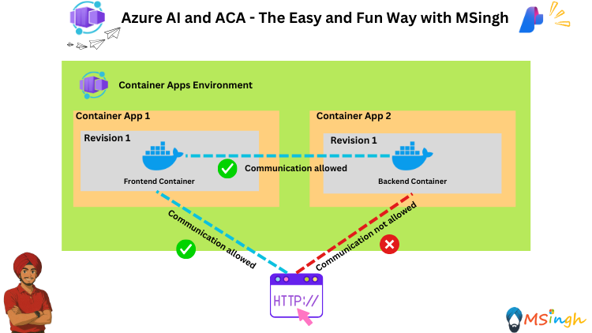

## Frontend-Backend Design Pattern with Azure AI and Azure Container Apps



### Lab Overview
In this lab, we will explore the Frontend-Backend design pattern using Azure AI and Azure Container Apps. We will cover the following topics:
- Understanding the Frontend-Backend design pattern
- Implementing a simple Frontend-Backend application using Azure Container Apps
- Integrating Azure AI services into the application
- Controlling Communication between Frontend and Backend and incoming external ingress

### Setting Export Variables
Let's quickly go ahead and set some export variables for script usage as part of this lab exercise.
```bash
export ACR_NAME="YOUR_ACR_NAME"
export RG_NAME="YOUR_RESOURCE_GROUP_NAME"
export ACA_ENV_NAME="YOUR_ACA_ENV_NAME"
export AZURE_API_URL="YOUR_AZURE_API_URL"
export AZURE_API_KEY="YOUR_AZURE_API_KEY"
export AZURE_MODEL_NAME="YOUR_AZURE_MODEL_NAME"
```

### Building Backend Application and Pushing to ACR
We will firstly build the backend application Docker image and then push it to the Azure Container Registry (ACR). The backend application is in the [ChatBackend](./ChatBackend/app.py) directory

```bash
# Navigate to the backend directory
cd ChatBackend

# Build the Docker image
docker build -t $ACR_NAME.azurecr.io/chat-backend:latest .

# Log in to ACR
az acr login --name $ACR_NAME

# Push the Docker image to ACR
docker push $ACR_NAME.azurecr.io/chat-backend:latest
```

### Deploying the ChatBackend Application to Azure Container Apps
We will be Deploying the ChatBackend application to Azure Container Apps with the following environment variables and secrets:
1) `azure-api-url` - environment variable
2) `azure-api-key` - secret
3) `azure-model-name` - environment variable

TThe ChatBackend application will not have external access and will only be accessible from the frontend application or any other container app for that matter that runs in the same <strong>Container Apps Environment</strong>

```bash
az containerapp create \
  -g $RG_NAME -n chat-backend \
  --image $ACR_NAME.azurecr.io/chat-backend:latest \
  --environment $ACA_ENV_NAME \
  --target-port 5000 \
  --ingress internal \
  --registry-server $ACR_NAME.azurecr.io \
  --registry-identity system \
  --system-assigned \
  --secrets azure-api-key=$AZURE_API_KEY \
  --env-vars azure-api-url=$AZURE_API_URL azure-model-name=$AZURE_MODEL_NAME azure-api-key=secretref:azure-api-key
```

### Building the ChatFrontend Application and Pushing to ACR
We will now be building the `chat-frontend` application which is contained in the [chat-frontend](./chat-frontend/Dockerfile) directory. This application will be a React application that will communicate with the `ChatBackend` application.

>**Note**: When we are building the image for our frontend application, we will be passing the backend API URL as a build argument. We cannot pass it as an <strong>environment variable</strong> during deployment because this is very typical of how <strong>React</strong> applications are built.

```bash
# Get the containerapp environment default domain
export APP_DOMAIN=$(az containerapp env show -g $RG_NAME -n $ACA_ENV_NAME --query properties.defaultDomain -o tsv | tr -d '\r\n')

# Construct the backend API URL with the containerapp environment default domain
export BACKEND_API_URL="chat-backend.internal.$APP_DOMAIN"
```

Now go to the [./chat-frontend/nginx.conf](./chat-frontend/nginx.conf) file and update the `proxy_pass` directive to use the `BACKEND_API_URL` variable.

```bash
# Navigate to the chat-frontend directory
cd chat-frontend

# Build the Docker image
docker build -t $ACR_NAME.azurecr.io/chat-frontend:latest --build-arg VITE_BACKEND_URL=$BACKEND_API_URL .

# Push the Docker image to ACR
docker push $ACR_NAME.azurecr.io/chat-frontend:latest
```

### Deploying the Frontend Application to Azure Container Apps
A couple of quick points to clear the air before we deploy our frontend application to ACA:
1) The frontend application will need to know the backend API URL, which we have already set as a build argument during the Docker image build process.
2) We will be using the same Azure Container Apps environment as the backend application, so we don't need to set up any additional networking.
3) The frontend application needs to be publicly accessible, so we will enable external ingress during deployment.

```bash
az containerapp create \
  -g $RG_NAME -n chat-frontend \
  --image $ACR_NAME.azurecr.io/chat-frontend:latest \
  --environment $ACA_ENV_NAME \
  --target-port 80 \
  --ingress external \
  --registry-server $ACR_NAME.azurecr.io \
  --registry-identity system \
  --system-assigned 
```

You will notice that you are able to access the <strong>backend</strong> API from the <strong>frontend</strong> application without any CORS issues, as both applications are running within the same Azure Container Apps environment.

Now try running this command:
```bash
curl -X POST https://chat-backend.internal.${APP_DOMAIN}/chat \
  -H "Content-Type: application/json" \
  -d '{"message": "Hello, how are you!"}'
```

You will notice that you aren't able to access the backend API from your device's bash session as it is only accessible from within the Azure Container Apps environment. You might receive a response indicating that the resource is not found or that access is denied with this html page
```html
<!DOCTYPE html>
<html>
<head>
    <title>Azure Container App - Unavailable</title>
    <style type="text/css">
        html {
            height: 100%;
            width: 100%;
        }

        #feature {
            width: 960px;
            margin: 95px auto 0 auto;
            overflow: auto;
        }

        #content {
            font-family: "Segoe UI";
            font-weight: normal;
            font-size: 22px;
            color: #ffffff;
            float: left;
            width: 460px;
            margin-top: 68px;
            margin-left: 0px;
            vertical-align: middle;
        }

        #content h1 {
            font-family: "Segoe UI Light";
            color: #ffffff;
            font-weight: normal;
            font-size: 60px;
            line-height: 48pt;
            width: 800px;
        }

        p a, p a:visited, p a:active, p a:hover {
            color: #ffffff;
        }

        #content a.button {
            background: #0DBCF2;
            border: 1px solid #FFFFFF;
            color: #FFFFFF;
            display: inline-block;
            font-family: Segoe UI;
            font-size: 24px;
            line-height: 46px;
            margin-top: 10px;
            padding: 0 15px 3px;
            text-decoration: none;
        }

        #content a.button img {
            float: right;
            padding: 10px 0 0 15px;
        }

        #content a.button:hover {
            background: #1C75BC;
        }
    </style>
</head>
<body bgcolor="#00abec">
<div id="feature">
    <div id="content">
        <h1 id="unavailable">Error 404 - This Container App is stopped or does not exist.</h1>   
        <p id="tryAgain">The Container App you have attempted to reach is currently stopped or does not exist.</p>
        <p id="toAdmin">If you are the Container App administrator, please visit <a href="https://portal.azure.com/">Azure Portal</a>.</p>
    </div>
</div>
</body>
</html>
```

### Summary
In this lab, we have successfully deployed a simple chat application using Azure Container Apps. We created separate container apps for the frontend and backend, configured them to communicate with each other securely, and ensured that the frontend is publicly accessible while the backend is not. This architecture allows us to build scalable and secure applications using microservices.
