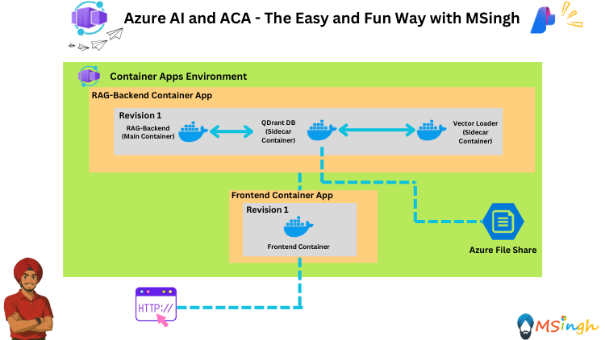
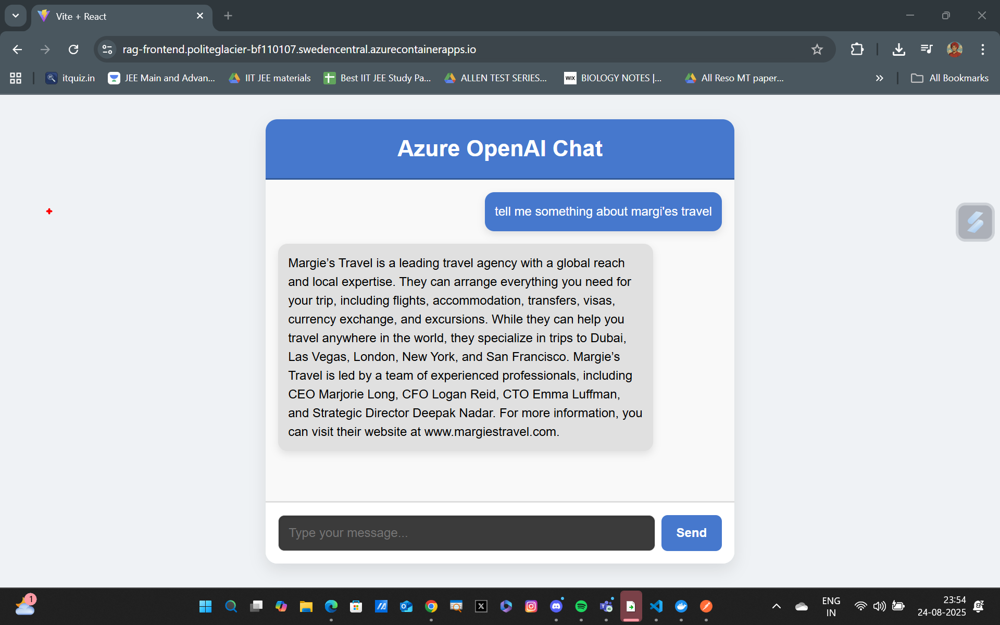

## RAG End-to-End Setup with Azure Container Apps



### Lab Overview
In this lab, you will set up a Retrieval-Augmented Generation (RAG) architecture using Azure Container Apps. The goal is to create a multi-container application that leverages the strengths of different AI models to provide a comprehensive solution for information retrieval and generation.

### Lab Prerequisites
Make sure you are completed with the [Azure File Share Storage Mount Lab](./Storage_Mount.md) and have the entire setup from that currently running in place. We will make use of the existing `QDrantDB` and `Vector-Loader` containers with `Azure File Share` Storage Mount to power the RAG architecture.

### Setting Export Variables
Let's quickly set some export variables for script usage.

```bash
export ACR_NAME="YOUR_ACR_NAME"
export RG_NAME="YOUR_RESOURCE_GROUP_NAME"
export ACA_ENV_NAME="YOUR_ACA_ENV_NAME"
export AZURE_API_URL="YOUR_AZURE_AI_FOUNDRY_API_URL"
export AZURE_API_KEY="YOUR_AZURE_AI_FOUNDRY_API_KEY"
export AZURE_MODEL_NAME="YOUR_AZURE_AI_FOUNDRY_CHAT_MODEL_NAME"
export EMBEDDING_MODEL_NAME="YOUR_EMBEDDING_MODEL_NAME"
```

### Building the Backend Application
Let's quickly build our backend image and push to Azure Container Registry.

```bash
# Navigate to the backend application directory
cd backend

# Build the Docker image
docker build -t $ACR_NAME.azurecr.io/rag-backend:latest .

# Log in to Azure Container Registry
az acr login --name $ACR_NAME

# Push the Docker image to Azure Container Registry
docker push $ACR_NAME.azurecr.io/rag-backend:latest
```

### Deploying Backend Application to Azure Container Apps
Now that we have our backend application image in Azure Container Registry, we will quickly deploy that as a seperate container app within our existing Container Apps Environment.

```bash
# setting the QDRANT_CLIENT_URL
export QDRANT_CLIENT_URL="http://localhost:6333/"
```

Now we will finally deploy our Backend Application to Azure Container Apps as a seperate container app. We will name our backend application instance as `rag-backend`.

```bash
az containerapp create \
  -g $RG_NAME -n rag-backend \
  --image $ACR_NAME.azurecr.io/rag-backend:latest \
  --environment $ACA_ENV_NAME \
  --target-port 5000 \
  --min-replicas 1 \
  --ingress external \
  --registry-server $ACR_NAME.azurecr.io \
  --registry-identity system \
  --system-assigned \
  --secrets azure-api-key=$AZURE_API_KEY \
  --env-vars azure-api-url=$AZURE_API_URL azure-model-name=$AZURE_MODEL_NAME azure-api-key=secretref:azure-api-key embedding-model-name=$EMBEDDING_MODEL_NAME qdrant-client-url=$QDRANT_CLIENT_URL
```

Let's now quickly grab the yaml definition file of the `rag-backend` container app.
```bash
az containerapp show \
  --name rag-backend \
  --resource-group $RG_NAME \
  --output yaml > app.yaml
```

We will now edit the yaml file to include `QDrantDB` and `Vector-Loader` containers in the same container app as `rag-backend`. Include the following yaml snippet in the container app's yaml file:
```yaml
template:
    containers:
    - env:
      - name: azure-api-url
        value: https://carbonopsdevai4434735199.openai.azure.com/ # This value would be different for you
      - name: azure-model-name
        value: gpt-4.1 # This value would be different for you
      - name: azure-api-key
        secretRef: azure-api-key
      - name: embedding-model-name
        value: text-embedding-ada-002 # This value would be different for you
      - name: qdrant-client-url
        value: http://localhost:6333/
      image: $ACR_NAME.azurecr.io/rag-backend:latest  # Replace $ACR_NAME with your container registry name
      imageType: ContainerImage
      name: rag-backend
      resources:
        cpu: 0.5
        ephemeralStorage: 2Gi
        memory: 1Gi
    - image: qdrant/qdrant:latest
      imageType: ContainerImage
      name: storagemountdemoapp
      resources:
        cpu: 0.5
        ephemeralStorage: 2Gi
        memory: 1Gi
      volumeMounts:
      - volumeName: my-azure-file-volume
        mountPath: /qdrant/storage
    - image: $ACR_NAME.azurecr.io/vector-loader:latest # Replace $ACR_NAME with your container registry name
      imageType: ContainerImage
      name: vector-loader
      resources:
        cpu: 0.5
        ephemeralStorage: 2Gi
        memory: 1Gi
    initContainers: null
    revisionSuffix: ''
    scale:
      cooldownPeriod: 300
      maxReplicas: 10
      minReplicas: 1
      pollingInterval: 30
      rules: null
    serviceBinds: null
    terminationGracePeriodSeconds: null
    volumes:
    - name: my-azure-file-volume
      storageName: mystoragemount
      storageType: AzureFile
```

Finally update the container app with the updated yaml file:
```bash
az containerapp update \
  --name rag-backend \
  --resource-group $RG_NAME \
  --yaml app.yaml \
  --output table
```

### Building the Frontend Application
We will now be building the chat-frontend application which is contained in the [chat-frontend](./chat-frontend/Dockerfile) directory. This application will be a React application that will communicate with the ChatBackend application.

>**Note**: When we are building the image for our frontend application, we will be passing the backend API URL as a build argument. We cannot pass it as an environment variable during deployment because this is very typical of how React applications are built.

```bash
# Get the containerapp environment default domain
export APP_DOMAIN=$(az containerapp env show -g $RG_NAME -n $ACA_ENV_NAME --query properties.defaultDomain -o tsv | tr -d '\r\n')

# Construct the backend API URL with the containerapp environment default domain
export BACKEND_API_URL="rag-backend.$APP_DOMAIN"
```

Before building our frontend application, we need to set the backend API URL. Go to the [./chat-frontend/nginx.conf](./chat-frontend/nginx.conf) file and update the `proxy_pass` directive to use the `BACKEND_API_URL` variable.

```bash
# Navigate to the chat-frontend directory
cd chat-frontend

# Build the Docker image
docker build -t $ACR_NAME.azurecr.io/rag-frontend:latest --build-arg VITE_BACKEND_URL=$BACKEND_API_URL .

# Push the Docker image to ACR
docker push $ACR_NAME.azurecr.io/rag-frontend:latest
```

### Deploying the Frontend Application to Azure Container Apps
We will now deploy our Frontend Application to Azure Container Apps as a separate container app. We will name our frontend application instance as `rag-frontend`.

```bash
az containerapp create \
  -g $RG_NAME -n rag-frontend \
  --image $ACR_NAME.azurecr.io/rag-frontend:latest \
  --environment $ACA_ENV_NAME \
  --target-port 80 \
  --min-replicas 1 \
  --ingress external \
  --registry-server $ACR_NAME.azurecr.io \
  --registry-identity system \
  --system-assigned 
```

### Seeing RAG in Action 😎
You may now access your frontend application and interact with the RAG system!
Try a couple of queries:
```text
- what is margies travel?
- can you tell me about the leadership of Margie's Travel?
- what travel accomodations are offered in dubai?
- what are options available in las vegas?
- what travel accomodations are offered in las vegas?
```


