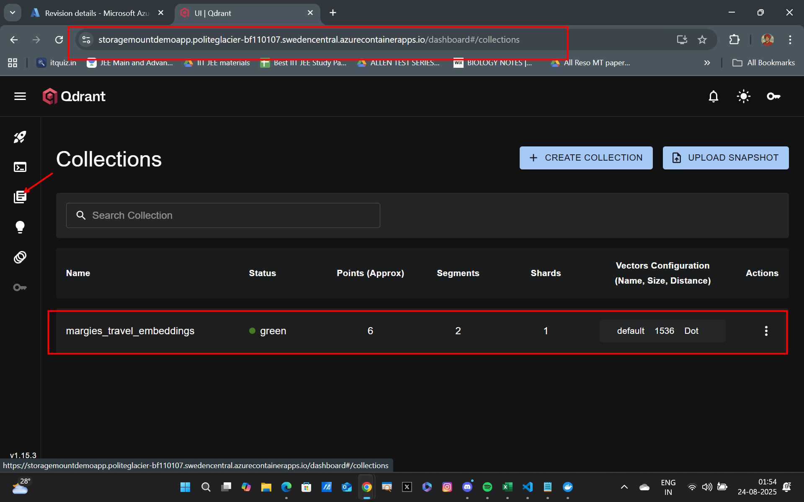

## Storage Mount with Azure File Share and Azure Container Apps


### Lab Overview
In this lab, you will learn how to mount an Azure File Share to an Azure Container App. This allows your containerized applications to access shared files stored in Azure Files, enabling scenarios such as content sharing, configuration management, and more.

### Setting Export Variables
Let's quickly set some export variables in our bash terminal for script usage:
```bash
export ACR_NAME="YOUR_ACR_NAME"
export RG_NAME="YOUR_RESOURCE_GROUP_NAME"
export ACA_ENV_NAME="YOUR_ACA_ENV_NAME"
export STORAGE_ACCOUNT_NAME="YOUR_STORAGE_ACCOUNT_NAME"
```

### Creating Azure Storage Account with Azure File Share Add-On
We will now create our `Azure Storage Account` resource which will have the `large-file-share` property <strong>enabled</strong>. This Storage Account's Azure File Share Add-On will serve as the Azure File Share <strong>Storage Mount</strong> in <strong>Azure Container Apps Environment</strong>

```bash
az storage account create \
  --resource-group $RG_NAME \
  --name $STORAGE_ACCOUNT_NAME \
  --location "swedencentral" \
  --kind StorageV2 \
  --sku Standard_LRS \
  --enable-large-file-share \
  --query provisioningState
```

>**Note**: The storage account will be created in `swedencentral` region. If you want to create it in a different region, make sure to update the `--location` parameter accordingly.

Once created, the command returns a "Succeeded" message.

We will now create a Azure Storage File Share named as `myfileshare`.

```bash
az storage share-rm create \
  --resource-group $RG_NAME \
  --storage-account $STORAGE_ACCOUNT_NAME \
  --name "myfileshare" \
  --quota 1024 \
  --enabled-protocols SMB \
  --output table
```

>**Note**: The Azure Storage File Share will be created with a quota of 1024 GB and will support the SMB protocol. You can adjust these parameters as needed for your specific use case. Also the name is `myfileshare`; if you want to use a different name, make sure to update the `--name` parameter accordingly.

The file share that gets created looks like this when viewing through the Azure Portal.


We will now fetch the storage account key. 
```bash
STORAGE_ACCOUNT_KEY=`az storage account keys list -n $STORAGE_ACCOUNT_NAME --query "[0].value" -o tsv`
```

The storage account key is required to create the storage link in your Container Apps environment. Container Apps does not support identity-based access to Azure file shares.

### Create the Storage Mount in Azure Container Apps Environment
Now we will create the storage mount in the Azure Container Apps environment using the Azure CLI. This will allow your containerized applications to access the Azure File Share.

```bash
az containerapp env storage set \
  --access-mode ReadWrite \
  --azure-file-account-name $STORAGE_ACCOUNT_NAME \
  --azure-file-account-key $STORAGE_ACCOUNT_KEY \
  --azure-file-share-name "myfileshare" \
  --storage-name "mystoragemount" \
  --name $ACA_ENV_NAME \
  --resource-group $RG_NAME \
  --output table
```

This command creates a link between container app environment and the file share created with the az storage share-rm command.

The storage mount is visible within the Azure Portal under the Container Apps environment settings.


### Containerising the Vector-Loader Application and Pushing Image to ACR
We will now containerise the [Vector Loader Application](./VectorLoader/app.py).

```bash
# Navigate to Vector-Loader Application's root directory
cd VectorLoader

# Build the Docker image
docker build -t $ACR_NAME.azurecr.io/vector-loader:latest .

# Log in to Azure Container Registry
az acr login --name $ACR_NAME

# Push the Docker image to Azure Container Registry
docker push $ACR_NAME.azurecr.io/vector-loader:latest
```

### Deploying the Container to Azure Container Apps
Now that we have pushed the Docker image to Azure Container Registry, we can deploy it to Azure Container Apps.

Within a single container app that sits in our Azure Container Apps environment, we will be deploying two containers:
1) `vector-loader`: This container will be responsible for loading data into the QDrantDB Vector Database and thus, will act as the <strong>sidecar container</strong>
2) `QdrantDB`: This container will host the QDrantDB Vector Database. This will house all the vector embeddings and textual data and thus, will act as the <strong>main application container</strong>

We will first create the container app with only the `QdrantDB` container and then later on add the `vector-loader` container along with the `storage mount` served by the Azure File Share.

```bash
az containerapp create \
  -g $RG_NAME -n storagemountdemoapp \
  --image qdrant/qdrant:latest \
  --environment $ACA_ENV_NAME \
  --target-port 6333 \
  --ingress external \
  --registry-server $ACR_NAME.azurecr.io \
  --registry-identity system \
  --system-assigned 
```

### Adding the Storage Mount and Vector Loader Sidecar Container
We will first fetch the <strong>YAML</strong> definition of the container app.

```bash
az containerapp show \
  --name storagemountdemoapp \
  --resource-group $RG_NAME \
  --output yaml > app.yaml
```

We will now include the `vector-loader` sidecar container and the storage mount in the `app.yaml` file.

Add the following under `template` carefully:
```yaml
containers:
    - image: qdrant/qdrant:latest
      imageType: ContainerImage
      name: storagemountdemoapp
      resources:
        cpu: 0.5
        ephemeralStorage: 2Gi
        memory: 1Gi
      volumeMounts:
      - volumeName: my-azure-file-volume
        mountPath: /qdrant/storage
    - image: $ACR_NAME.azurecr.io/vector-loader:latest # Replace $ACR_NAME with your container registry name
      imageType: ContainerImage
      name: vector-loader
      resources:
        cpu: 0.5
        ephemeralStorage: 2Gi
        memory: 1Gi
    initContainers: null
    revisionSuffix: ''
    scale:
      cooldownPeriod: 300
      maxReplicas: 10
      minReplicas: null
      pollingInterval: 30
      rules: null
    serviceBinds: null
    terminationGracePeriodSeconds: null
    volumes:
    - name: my-azure-file-volume
      storageName: mystoragemount
      storageType: AzureFile
```

Now apply the changes using the Azure CLI:

```bash
az containerapp update \
  --name storagemountdemoapp \
  --resource-group $RG_NAME \
  --yaml app.yaml \
  --output table
```

### Seeing the Magic in Action 😎

Navigating to `Containers` tab under the `Application` section in Azure Portal, you should see both the `QdrantDB` and `vector-loader` containers listed there.


--

You can also view the logs for both the containers:


--

Navigate to your Container App's URL and to the `/dashboard` path to see the QdrantDB dashboard.
You will observe that you have a vector collection named `margies_travel_embeddings`.


--

Now go to your storage account's file share tab and generate a snapshot of the current file share store to view the stored data from the QDrantDB vector database.


--

Once the snapshot is created, navigate to the `collections` folder to view the stored data from the QDrantDB vector database.


--


--

You will be able to see quite some files like the shard_key_mapping.json file and other really cool database configuration stuff which I honestly cannot really make sense of 😅. But this is enough to give us the confidence that we have an Azure File Share storage mount backing our QDrant Vector Database 😁.


--

### Summary
In this lab, we successfully set up a multi-container application using Azure Container Apps. We created a QDrantDB container to host our vector database and a vector-loader sidecar container to handle data loading. By leveraging Azure File Share as a storage mount, we ensured that our vector database's data is persistently stored and easily accessible. Through the Azure Portal, we were able to visualize the running containers, view logs, and explore the stored data, confirming the successful integration of all components.
