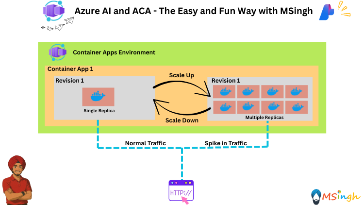

## Event Driven HTTP Scaling in Azure Container Apps 



### Lab Overview
In this lab, you will learn how to implement event-driven HTTP scaling in Azure Container Apps. You will explore how to automatically scale your containerized applications based on HTTP traffic and other events, ensuring optimal performance and resource utilization.

### Setting Export Variables
Lets quickly set some export variables for script usage in the lab.
```bash
export ACR_NAME="YOUR_ACR_NAME"
export RG_NAME="YOUR_RESOURCE_GROUP_NAME"
export ACA_ENV_NAME="YOUR_ACA_ENV_NAME"
export AZURE_API_URL="YOUR_AZURE_API_URL"
export AZURE_API_KEY="YOUR_AZURE_API_KEY"
export AZURE_MODEL_NAME="YOUR_AZURE_MODEL_NAME"
```

### Building Our Backend Image and Pushing to ACR
For this lab we will be using the [ChatBackend](./ChatBackend/app.py) application as our backend application. We will firstly build the backend application Docker image and then push it to the Azure Container Registry (ACR).

```bash
# Navigate to the ChatBackend directory
cd ChatBackend

# Build the Docker image
docker build -t $ACR_NAME.azurecr.io/chatbackend:latest .

# Log in to ACR
az acr login --name $ACR_NAME

# Push the Docker image to ACR
docker push $ACR_NAME.azurecr.io/chatbackend:latest
```

### Deploy the Application to Azure Container Apps Environment
Now we will deploy our `ChatBackend` application image as a container within our Azure Container Apps environment.

```bash
az containerapp create \
  -g $RG_NAME -n chat-backend \
  --image $ACR_NAME.azurecr.io/chat-backend:latest \
  --environment $ACA_ENV_NAME \
  --target-port 5000 \
  --ingress external \
  --min-replicas 1 \
  --registry-server $ACR_NAME.azurecr.io \
  --registry-identity system \
  --system-assigned \
  --secrets azure-api-key=$AZURE_API_KEY \
  --env-vars azure-api-url=$AZURE_API_URL azure-model-name=$AZURE_MODEL_NAME azure-api-key=secretref:azure-api-key
```

### Adding our HTTP Scaling Rule
We will now add an HTTP Scaling rule. The rule will state that if the HTTP traffic to the `ChatBackend` application exceeds a certain concurrency threshold of `1` requests at a time, the application should scale up to handle the increased load with the `min-replicas` set to `1` and `max-replicas` set to `10`.

```bash
az containerapp update \
    --name chat-backend \
    --resource-group $RG_NAME \
    --min-replicas 1 \
    --max-replicas 10 \
    --scale-rule-name my-http-scale-rule \
    --scale-rule-http-concurrency 1
```

The way the HTTP Scaler works is:
```simple
Desired replicas = (current concurrent requests ÷ http_concurrency target)
```

Example:
 - 25 concurrent requests
 - Target concurrency = 1
 - Desired replicas = 25
 - ACA then clamps this number between your --min-replicas (1) and --max-replicas (10).

So in this case, it would only go up to 10 replicas, even if more requests are coming in.


--

### Starting Log Output
Before we can ramp up our HTTP traffic and observe the scaling behavior, let's start by viewing the logs from our `ChatBackend` application.

Open a new terminal and run the following command:

```bash
az containerapp logs show \
    --name chat-backend \
    --resource-group $RG_NAME \
    --type=system \
    --follow=true
```

This command will display the logs from the `ChatBackend` application, allowing us to monitor its performance and scaling actions in real-time.

Initially, the logs will look something like this:
```bash
{"TimeStamp": "2025-08-26T17:44:46Z", "Type": "Normal", "ContainerAppName": null, "RevisionName": null, "ReplicaName": null, "Msg": "Connecting to the events collector...", "Reason": "StartingGettingEvents", "EventSource": "ContainerAppController", "Count": 1}

{"TimeStamp": "2025-08-26T17:44:46Z", "Type": "Normal", "ContainerAppName": null, "RevisionName": null, "ReplicaName": null, "Msg": "Successfully connected to events server", "Reason": "ConnectedToEventsServer", "EventSource": "ContainerAppController", "Count": 1}

{"TimeStamp": "2025-08-26 17:42:19.4145161 +0000 UTC", "Type": "Warning", "ContainerAppName": "chat-backend", "RevisionName": "chat-backend--0000002", "ReplicaName": "chat-backend--0000002-7d67cb9688-mfpbq", "Msg": "Probe of StartUp failed with timeout in 1 seconds.", "Reason": "ProbeFailed", "EventSource": "ContainerAppController", "Count": 1}

{"TimeStamp": "2025-08-26 17:42:28 +0000 UTC", "Type": "Normal", "ContainerAppName": "chat-backend", "RevisionName": "chat-backend--0000002", "ReplicaName": "", "Msg": "Updating revision : chat-backend--0000002", "Reason": "RevisionUpdate", "EventSource": "ContainerAppController", "Count": 5}

{"TimeStamp": "2025-08-26 17:42:29 +0000 UTC", "Type": "Normal", "ContainerAppName": "chat-backend", "RevisionName": "chat-backend--0000002", "ReplicaName": "", "Msg": "Successfully provisioned revision 'chat-backend--0000002'", "Reason": "RevisionReady", "EventSource": "ContainerAppController", "Count": 4}

{"TimeStamp": "2025-08-26 17:42:59 +0000 UTC", "Type": "Normal", "ContainerAppName": "chat-backend", "RevisionName": "chat-backend--0000001", "ReplicaName": "", "Msg": "KEDA is stopping the watch for revision 'chat-backend--0000001' to monitor scale operations for this revision", "Reason": "KEDAScalersStopped", "EventSource": "KEDA", "Count": 1}

{"TimeStamp": "2025-08-26 17:42:59 +0000 UTC", "Type": "Warning", "ContainerAppName": "chat-backend", "RevisionName": "chat-backend--0000001", "ReplicaName": "", "Msg": "ScaledObject was removed from KEDA watch and would not be auto-scaled.", "Reason": "ScaledObjectDeleted", "EventSource": "KEDA", "Count": 1}

{"TimeStamp": "2025-08-26 17:42:59.5946964 +0000 UTC", "Type": "Warning", "ContainerAppName": "chat-backend", "RevisionName": "chat-backend--0000001", "ReplicaName": "chat-backend--0000001-776b999fbd-xp8j7", "Msg": "Container 'chat-backend' was terminated with exit code '' and reason 'ManuallyStopped'", "Reason": "ContainerTerminated", "EventSource": "ContainerAppController", "Count": 1}
```

### View Scaling in Azure Portal
Let's now ramp up our HTTP traffic and observe the scaling behavior.

```bash
seq 1 100 | xargs -I{} -P20 curl -s -X POST https://<ACA-FQDN>/chat \
  -H "Content-Type: application/json" \
  -d '{"message":"tell me something about France"}'
```

You can see the total number of replicas running in the Azure Portal.


--


--

You will also observe the logs running in the terminal to now include scaling events which will look something like this:
```bash
{
    "TimeStamp":"2023-08-01 18:09:52 +0000 UTC",
    "Type":"Normal",
    "ContainerAppName":"chat-backend",
    "RevisionName":"chat-backend--00001111",
    "ReplicaName":"chat-backend--00001111-aaaaa22222-bbbb",
    "Msg":"Replica 'chat-backend--00001111-aaaaa22222-bbbb' has been scheduled to run on a node.",
    "Reason":"AssigningReplica",
    "EventSource":"ContainerAppController",
    "Count":1
}
```

### Observability and Metrics
You can also go to the `Metrics` section under the `Monitoring` tab in the Azure Portal to get a view of all the events that are/were happening in your container app.


--


--


--


--

### CPU Scaling (Optional - Just for Reference)
CPU scaling allows your app to scale in or out depending on how much the CPU is being used.

For example, if you create a CPU scale rule with a utilization value of 50, Azure Container Apps creates more replicas of your container app when the average CPU utilization for all replicas reaches 50%.

```bash
az containerapp update \
    --name chat-backend \
    --resource-group $RG_NAME \
    --min-replicas 1 \
    --max-replicas 10 \
    --scale-rule-name my-cpu-scale-rule \
    --scale-rule-type cpu \
    --scale-rule-metadata type=Utilization value=50
```

### Memory Scaling (Optional - Just for Reference)

Memory scaling allows your app to scale in or out depending on how much memory is being used.

For example, if you create a memory scale rule with a utilization value of 50, Azure Container Apps creates more replicas of your container app when the average memory utilization for all replicas reaches 50%.

```bash
az containerapp update \
    --name chat-backend \
    --resource-group $RG_NAME \
    --min-replicas 1 \
    --max-replicas 10 \
    --scale-rule-name my-memory-scale-rule \
    --scale-rule-type memory \
    --scale-rule-metadata type=Utilization value=50
```

### Summary
In this lab, you learned how to set up HTTP-based scaling for your Azure Container Apps using KEDA. You observed how the system scales in response to incoming HTTP requests and how to monitor these scaling events through logs and the Azure Portal. Additionally, you explored optional CPU and memory scaling configurations to further optimize your application's performance.