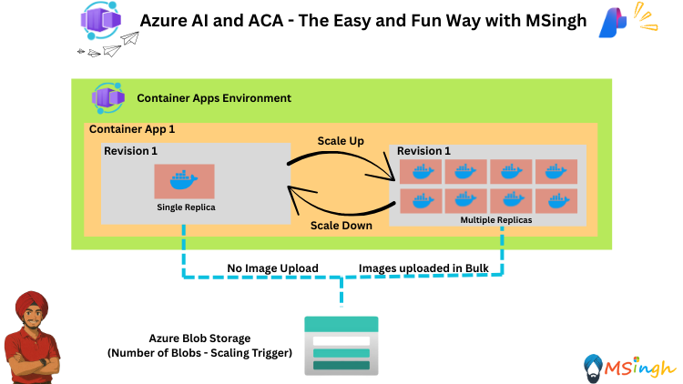
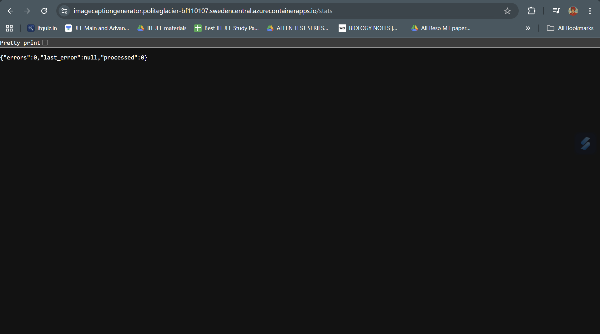
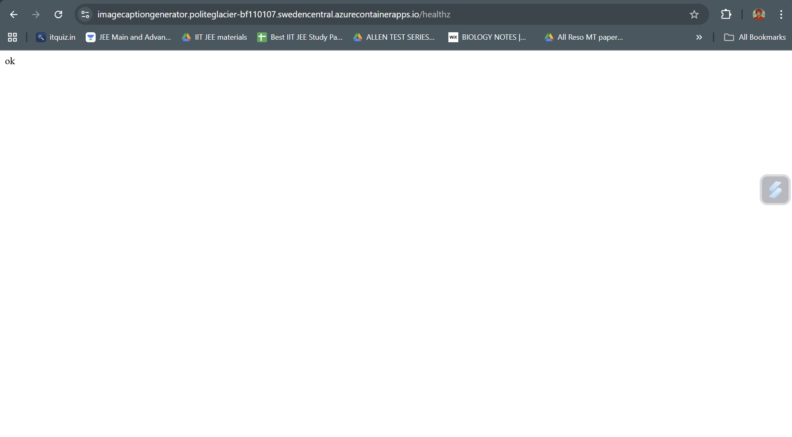
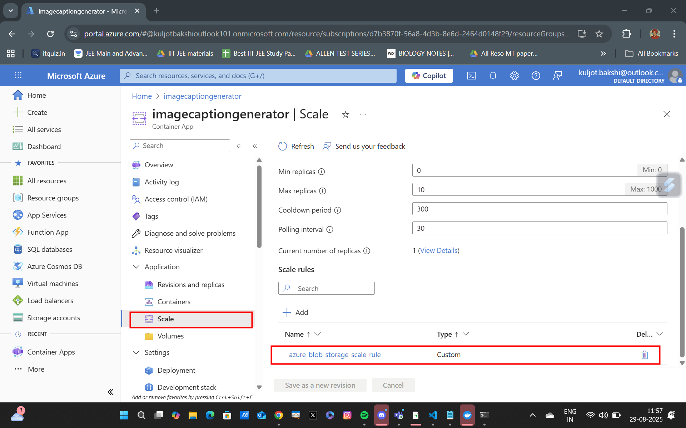
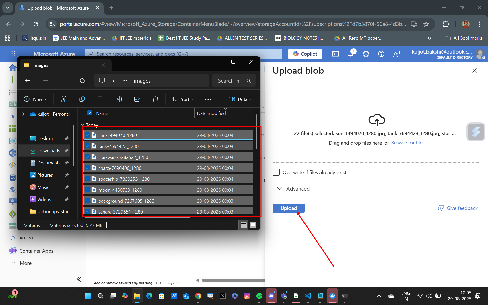
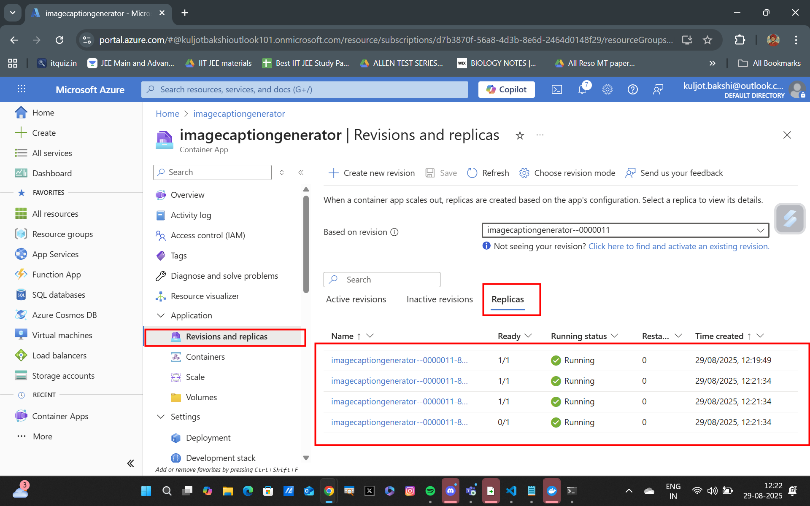
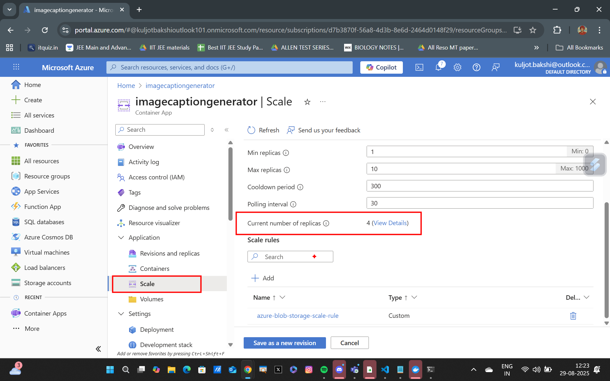
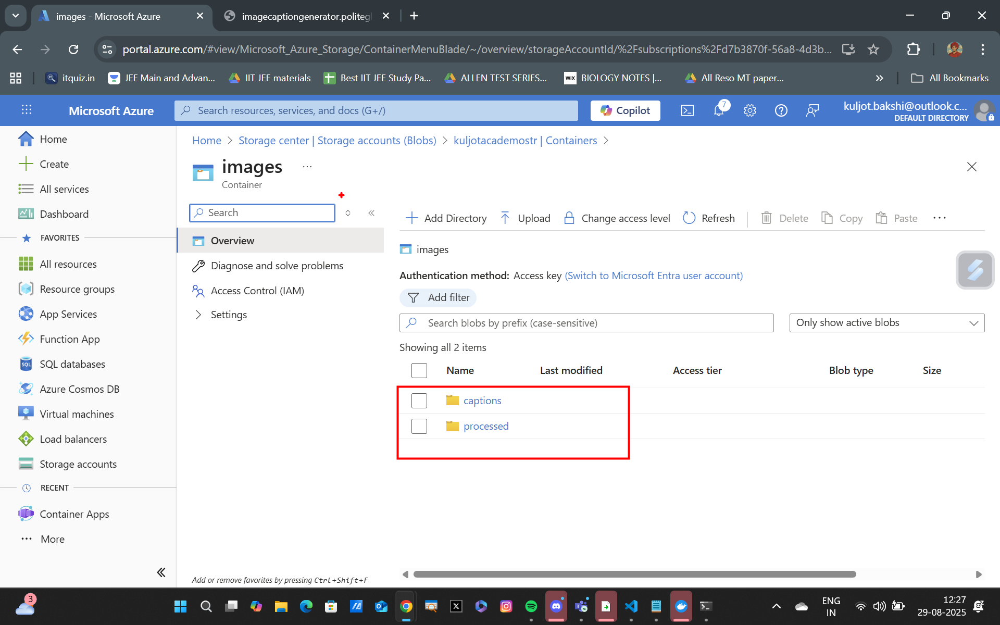
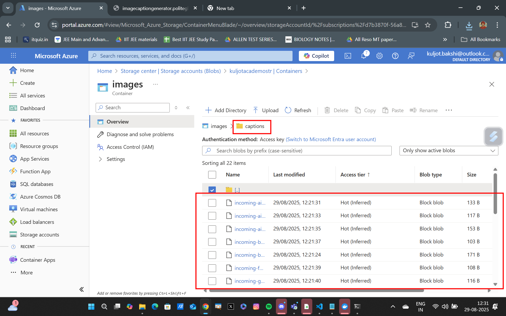

## Blob Storage Scaler with Azure Container Apps



### Lab Overview
In this lab, you will learn how to implement a Blob Storage Scaler using Azure Container Apps. The solution will automatically scale the processing of images stored in Azure Blob Storage by leveraging Azure OpenAI for image captioning. You will set up an event-driven architecture that responds to new images being uploaded, processes them, and stores the results efficiently.

### Resources to be deployed before beginning the lab
1. Azure Blob Storage Account
2. Azure Container Apps Environment
3. Azure AI Foundry Project with a multi-modal chatg model like GPT-4.1

### Setting Export Variables
```bash
export RG_NAME="your_resource_group_name"
export ACR_NAME="your_acr_name"
export ACA_ENV_NAME="your_aca_environment_name"
export STORAGE_ACCOUNT_NAME="your_storage_account_name"
export STORAGE_ACCOUNT_URL="your_storage_account_url"
export STORAGE_ACCOUNT_CONNECTION_STRING="storage_account_connection_string"
export CONTAINER_NAME="your_storage_account_container_name"
export AZURE_OPENAI_ENDPOINT="your_azure_openai_endpoint"
export AZURE_OPENAI_API_KEY="your_azure_openai_api_key"
export AZURE_OPENAI_DEPLOYMENT="your_azure_openai_deployment"
```

### Containerising Image Caption Generator Application and Pushing to ACR
The Image Caption Generator Application is in the [ImageCaptionGenerator](./ImageCaptionGenerator/app.py) directory.

```bash
# Navigate into the Application Directory
cd ImageCaptionGenerator

# Build the Docker image
docker build -t $ACR_NAME.azurecr.io/imagecaptiongenerator:latest .

# Log in to ACR
az acr login --name $ACR_NAME

# Push the Docker image to ACR
docker push $ACR_NAME.azurecr.io/imagecaptiongenerator:latest
```

### Deploying the Image Caption Generator to Azure Container Apps

```bash
# Create the Azure Container App
az containerapp create \
  -g $RG_NAME -n imagecaptiongenerator \
  --image $ACR_NAME.azurecr.io/imagecaptiongenerator:latest \
  --min-replicas 1 \
  --environment $ACA_ENV_NAME \
  --target-port 5000 \
  --ingress external \
  --registry-server $ACR_NAME.azurecr.io \
  --registry-identity system \
  --system-assigned \
  --secrets azure-openai-api-key=$AZURE_OPENAI_API_KEY storage-account-connection-string=$STORAGE_ACCOUNT_CONNECTION_STRING \
  --env-vars azure-openai-endpoint=$AZURE_OPENAI_ENDPOINT azure-openai-deployment=$AZURE_OPENAI_DEPLOYMENT azure-openai-api-key=secretref:azure-openai-api-key storage-account-url=$STORAGE_ACCOUNT_URL storage-account-connection-string=secretref:storage-account-connection-string container-name=$CONTAINER_NAME
```

After deploying the container to azure container apps, go to the `/stats` endpoint to view the application statistics.


--

You can also navigate to the `/healthz` endpoint to check the health status of the application.


--

### Adding a Scaling Rule with Blob Storage Trigger
We will be adding a scaling rule to our Azure Container App that triggers when new images are uploaded to the Blob Storage container and the total number of which exceeds a threshold. This will allow the app to automatically scale out and process images in parallel by spinning up additional instances.

```bash
az containerapp update \
  --name imagecaptiongenerator \
  --resource-group $RG_NAME \
  --scale-rule-name azure-blob-storage-scale-rule \
  --scale-rule-type azure-blob \
  --scale-rule-metadata "blobContainerName=$CONTAINER_NAME" \
                        "blobCount=5" \
                        "accountName=$STORAGE_ACCOUNT_NAME" \
                        "connectionFromEnv=storage-account-connection-string" \
                        "cloud=AzurePublicCloud" \
  --scale-rule-auth "connection=storage-account-connection-string"
```

You can also view the scaling rule created in the Azure portal.


--


--

### Seeing Blob Scaling in Action

Go to your blob storage account container and upload all the images in the [images](./images/) in a bulk upload fashion to trigger the Azure Container App scaling.


--

You will now also notice that the Azure Container App has scaled out to handle the increased load by running multiple replicas.


--


--

### View the Application Output (Image Captions) in the Storage Account

Navigate to your storage account container and you'll notice the image captions generated by the application stored as json files.


--

You'll also be able to see the captions generated for each image in the `captions` folder.


--

### Summary
In this lab, we successfully deployed an image caption generator application to Azure Container Apps and configured it to scale automatically based on Blob Storage events. By leveraging Azure's event-driven architecture, we ensured that our application can handle varying workloads efficiently. The use of scaling rules based on Blob Storage triggers allows us to process images in parallel, improving the overall performance and responsiveness of the application.
